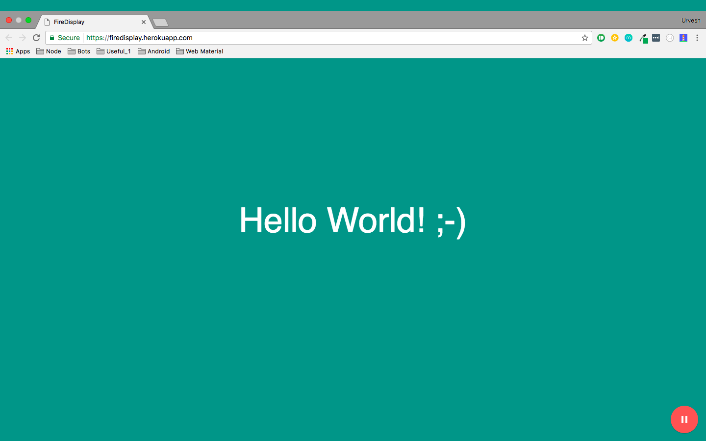
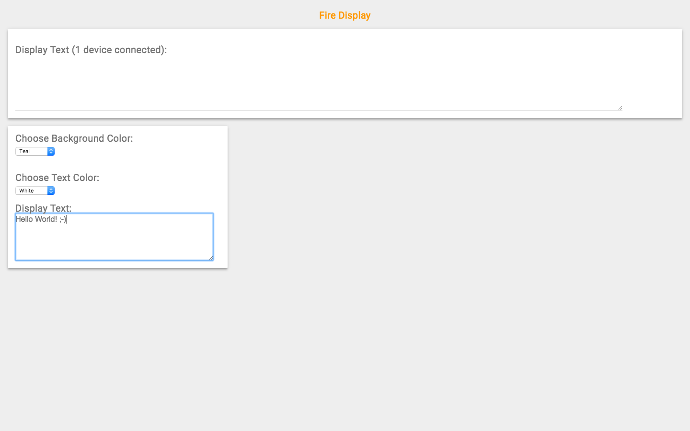

# firedisplay-client
This is basics of firebase realtime database using node.js.  

Basically it has two website to handle like a [client](https://firedisplay.herokuapp.com) and [admin](https://this-is-me-a1307.firebaseapp.com/)

## What does the client app do?
- Multiple devices can login or click the play icon on website and the device(s) are connected on stream.

## What does the admin app do?
- Once the device(s) click the play button admin gets list of devices connected.
- Admin can play around the keys like changing text specify of a device, change background color, change text color, type in main dialog
and the text would automatically fit to device(s)
- More fun features coming soon

Try it out:

1. [Client Website](https://firedisplay.herokuapp.com)

2. [Admin Website](https://this-is-me-a1307.firebaseapp.com/)

### Screenshots

  a. Client App
  
  

  
  b. Admin App
  
  

